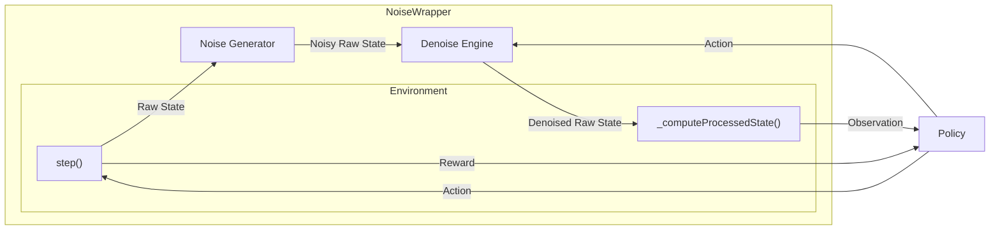

# DroneControl

Code base for simulation and practical experimentation for autonomous drone obstacle avoidance with noise injection.

## Component Interactions



## Making an environment config

To make an environment configuration, create a JSON in the `configs` directory of the following shape:

```json
{
    "xmin": float,
    "xmax": float,
    "ymin": float,
    "ymax": float,
    "zmin": float,
    "zmax": float,
    "provideFixedObstacles": bool,
    "obstacles": List[List[3]] or null,
    "minObstacles": int,
    "maxObstacles": int,
    "randomizeObstaclesEveryEpisode": bool,
    "fixedAltitude": bool,
    "episodeLength": int,
    "showDebugLines": bool,
    "randomizeDronePosition": bool,
    "simFreq": int,
    "controlFreq": int,
    "noiseParameters": {
        "mu": float,
        "sigma": float,
        "denoiseEngine": DenoiseEngineData
    }
}
```
### `DenoiseEngineData`

The following Denoise methods exist and the ways to add them into the experiment configuration:

#### 1. No Denoiser

To use no denoiser, just set `"denoiseEngine"` in the config JSON to `null`.

#### 2. Low Pass Filter

To use a Low Pass Filter as the Denoise Engine, set `"denoiseEngine"` to the following:

```JSON
{
    ...
    "denoiseEngine": {
        "method": "lpf",
        "parameters": {
            "order": int,
            "criticalFreq": float,
            "ftype": string
        }
    }
}
```

* `order`: Order of the filter. Can be thought of as the window size to consider while denoising the current observation.

* `criticalFreq`: Critical frequency of the underlying data. If you don't know what it means, just set it to `2`.

* `ftype`: Type of IIR to design. Options are `"bessel"` for Bessel/Thomson and `"butter"`, for Butterworth.

#### 3. Kalman Filter

To use a Kalman Filter as the Denoise Engine, set `"denoiseEngine"` to the following:

```JSON
{
    ...
    "denoiseEngine": {
        "method": "kf",
        "parameters": {
            "processNoise": float
        }
    }
}
```

* `processNoise`: Standard Deviation of the process noise.

## Training a Model

To train a model, you first need an environment in which it will be trained. For that, make the environment config file as shown above and place it in the `configs` directory. Then make a Training Configuration File of the following shape:

```json
{
    "taskName": str,
    "envConfigFile": str (path to file relative to configs/),
    "outputModelName": str (model name relative to SBAgent/models/)
}
```

Check out [trainConfigs/trainConfig1.json](trainConfigs/trainConfig1.json) to see an example.

Once the train configuration file is prepared, use the `TrainDispatcher.py` script to train the model (usage explained below).

## The Scripts

### [`TrainDispatcher.py`](./TrainDispatcher.py)

Used to train a model based on the given train config file.

```bash
python TrainDispatcher.py [-h] [-s STEPS] [--local] trainConfigPath
```

* `trainConfigPath` is the path to the train configuration file.
* `-s` to specify the number of timesteps to train for. Defaults to 2,000,000.
* Add the `--local` flag to run the training on your local machine. If this flag is omitted, the script generates a batch job configuration and dispatches it on one of the nodes on IIIT-H's HPC.

### [`SBAgent/EvaluateModel.py`](./SBAgent/EvaluateModel.py)

<!-- Used to evaluate a given model on a given environment. Allows flexibility outside of a defined experiment. To run it, run: -->

Used to evaluate an existing model on an environment template. The template allows the user to set the noise parameters and denoiser to be used as arguments instead of having to create a new file for every possible combination of the three. To run it, run:

```bash
cd SBAgent
python EvaluateModel.py [-h] [-t TRIALS] [--gui] [--no-gui] modelPath mu sigma {none,kf,lpf}
```

* `modelPath` is the relative path of the model to be evaluated.
* `mu` is the mean of the noise to be injected into the state space.
* `sigma` is the standard deviation of the noise to be injected into the state space.
* `{none,kf,lpf}` are the choices for the denoiser to use.
* `-t` to specify the number of episodes to evaluate the model for. Defaults to 10.
* `--gui` to launch the PyBullet window to visualize the agent behavior.

### [`SBAgent/EvaluationPipeline.py`](./SBAgent/EvaluateExperiment.py)

Used to perform a series of model evaluations in a single call. Defined in the code is a set of values of $\mu$, $\sigma$ and which denoiser to use, and the file calls `EvaluateModel.py` on every combination of the three variables, and prints the results of the evaluation. To run it:

```bash
cd SBAgent
python EvaluationPipeline.py [-h] [-t TRIALS] modelPath
```

* `modelPath` is path to the model to be evaluated.
* `-t` is the number of episodes each evaluation is done for.

*Though this script makes a call to `EvaluateModel`, it supresses all the print statements from that file to get a clean output. Only outputs are of the final evaluation results in table form.*

### [`SBAgent/TrainModel.py`](./SBAgent/TrainModel.py)

Used to train a model on a given environment. Allows flexibity outside of a defined experiment. Used internally by `TrainDispatcher.py`.


```bash
cd SBAgent
python TrainModel.py [-h] [-s STEPS] configFileName outputModelName
```

* `configFileName` is the name of the environment configuration file inside the `config` directory.
* `outputModelName` is the name to save the output model as. This must begin with either `base/` or `finetuned/` (for the current script it is should ideally always be `base/`) followed by the name of the model. The trained model is then saved in `SBAgent/models/<outputModelName>`.
* `-s` to specify the number of timesteps to train for. Default is 2,000,000.

## Models

Check out [base/ModelLogs.md](./SBAgent/models/base/ModelLogs.md) for the description of every model trained from scratch.

Check out [finetuned/ModelLogs.md](./SBAgent/models/finetuned/ModelLogs.md) for the description of every model finetuned from an existing model.