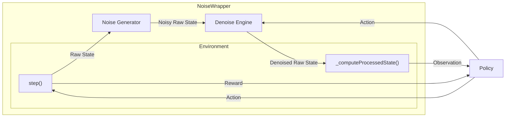

# DroneControl

Code base for simulation and practical experimentation for autonomous drone obstacle avoidance with noise injection.

## Component Interactions



## Designing an Experiment

An experiment has 2 parts:

1. Training phase: Choose an environment config to train a new agent on, and choose a model name to save the agent as after training.

2. Evaluation phase: Choose the model to evaluate, and the environment to evaluate it on. Notice that the environment that you evaluate the model on doesn't necessarily have to be the same as the one you trained it on.

To make an experiment, make a new config JSON in the `experimentConfigs/` directory. It should have the following shape:

```json
{
    "name": str,
    "trainParameters": {
        "config": str (Only the name of the config file. Must be in the configs directory),
        "outputModelName": str (base/finetuned + name of model. Must be in the SBAgent/models directory.)
    },
    "evaluationParameters": {
        "config": str (Only the name of the config file. Must be in the configs directory),
        "inputModelName": str (base/finetuned + name of model. Must be in the SBAgent/models directory.)
    }
}
```

Check out [experiment1.json](./experimentConfigs/experiment1.json) for reference.

From here, you do one of two things:

1. Train Step: Run `TrainDispatcher.py` to the model on the given environment. The script is written to dispatch a batch job on IIIT-H's HPC cluster, so modify it to run on your machine as needed.

2. Evaluation Step: Run `SBAgent/EvaluateExperiment.py` to evaluate the model in the given environment.

Both these scripts take the experiment config file location as an argument.

## Making an environment config

To make an environment configuration, create a JSON in the `configs` directory of the following shape:

```json
{
    "xmin": float,
    "xmax": float,
    "ymin": float,
    "ymax": float,
    "zmin": float,
    "zmax": float,
    "provideFixedObstacles": bool,
    "obstacles": List[List[3]] or null,
    "minObstacles": int,
    "maxObstacles": int,
    "randomizeObstaclesEveryEpisode": bool,
    "fixedAltitude": bool,
    "episodeLength": int,
    "showDebugLines": bool,
    "randomizeDronePosition": bool,
    "simFreq": int,
    "controlFreq": int,
    "noiseParameters": {
        "mu": float,
        "sigma": float,
        "denoiseEngine": DenoiseEngineData
    }
}
```
### `DenoiseEngineData`

The following Denoise methods exist and the ways to add them into the experiment configuration:

#### 1. No Denoiser

To use no denoiser, just set `"denoiseEngine"` in the config JSON to `null`.

#### 2. Low Pass Filter

To use a Low Pass Filter as the Denoise Engine, set `"denoiseEngine"` to the following:

```JSON
{
    ...
    "denoiseEngine": {
        "method": "lpf",
        "parameters": {
            "order": int,
            "criticalFreq": float,
            "ftype": string
        }
    }
}
```

* `order`: Order of the filter. Can be thought of as the window size to consider while denoising the current observation.

* `criticalFreq`: Critical frequency of the underlying data. If you don't know what it means, just set it to `2`.

* `ftype`: Type of IIR to design. Options are `"bessel"` for Bessel/Thomson and `"butter"`, for Butterworth.

#### 3. Kalman Filter

To use a Kalman Filter as the Denoise Engine, set `"denoiseEngine"` to the following:

```JSON
{
    ...
    "denoiseEngine": {
        "method": "kf",
        "parameters": {
            "processNoise": float
        }
    }
}
```

* `processNoise`: Standard Deviation of the process noise.